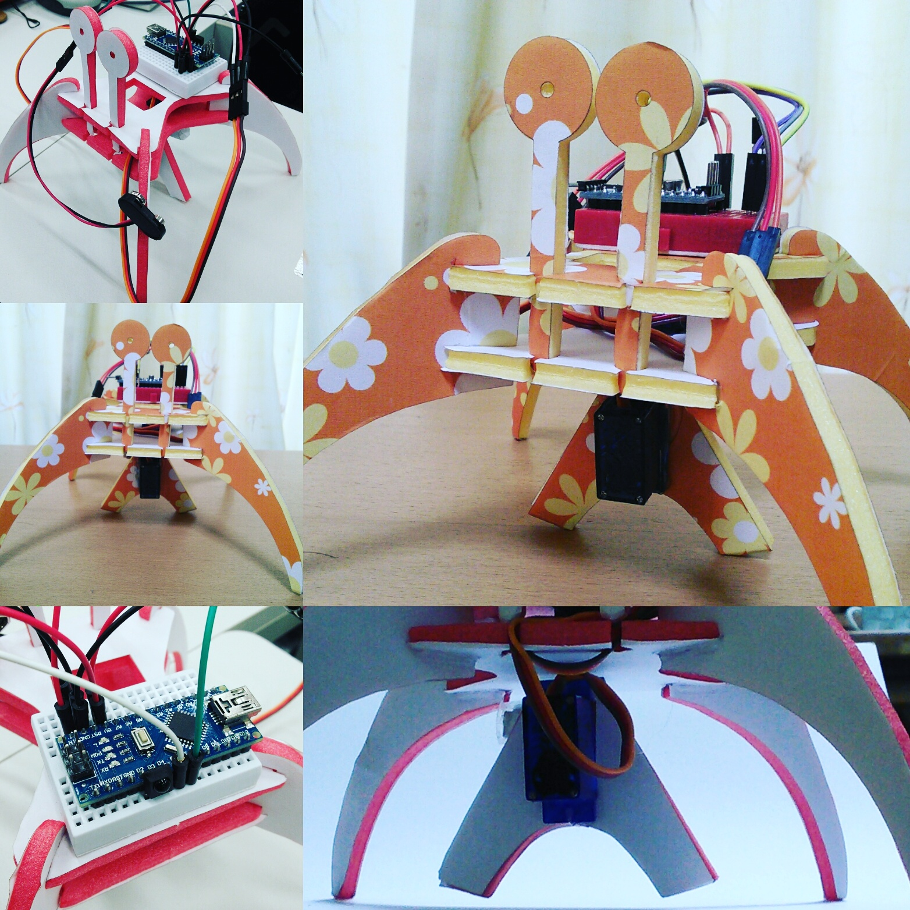
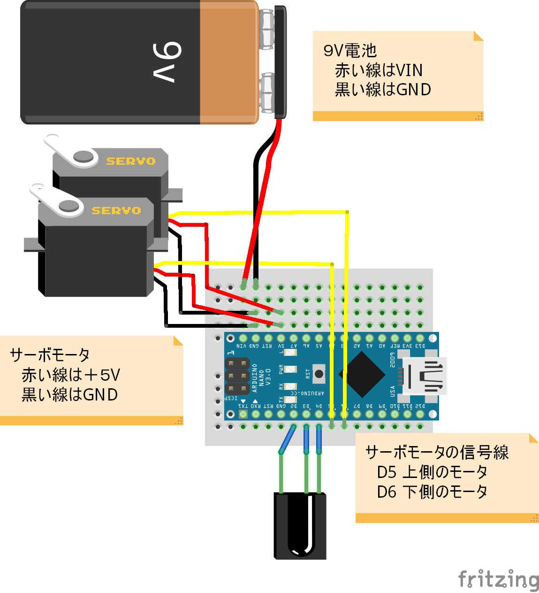

# Elecrab sample program for Arduino

This Sample is to control the " elecrab ".

##Version 0.1

##Example of use

I am controlling the crab type robot " elecrab " use this library .

##Circuit diagram

